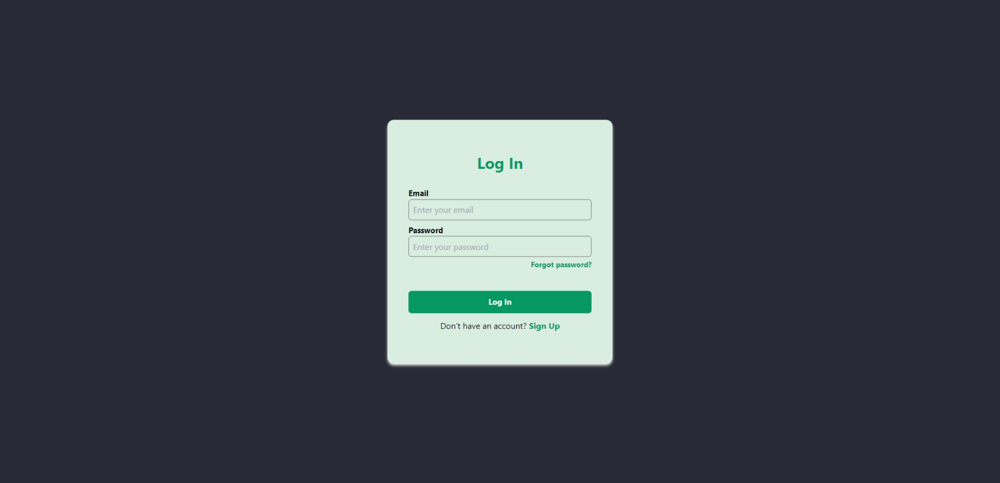
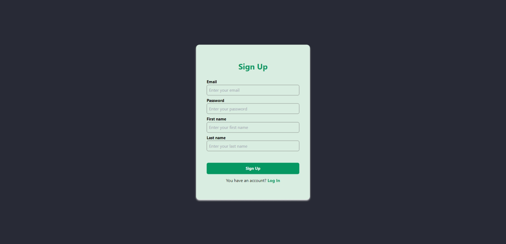
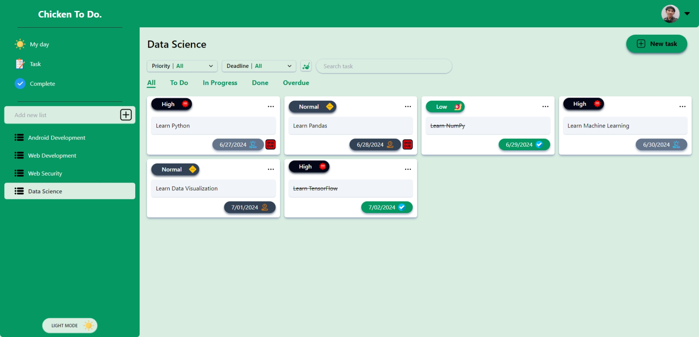
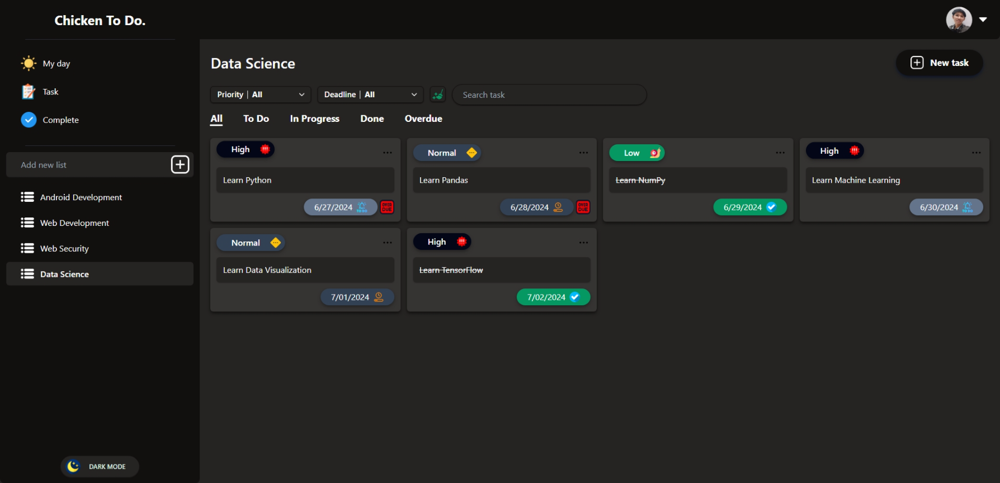
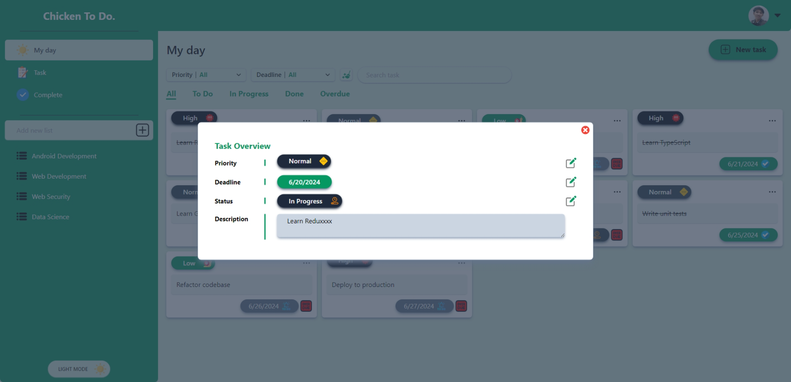
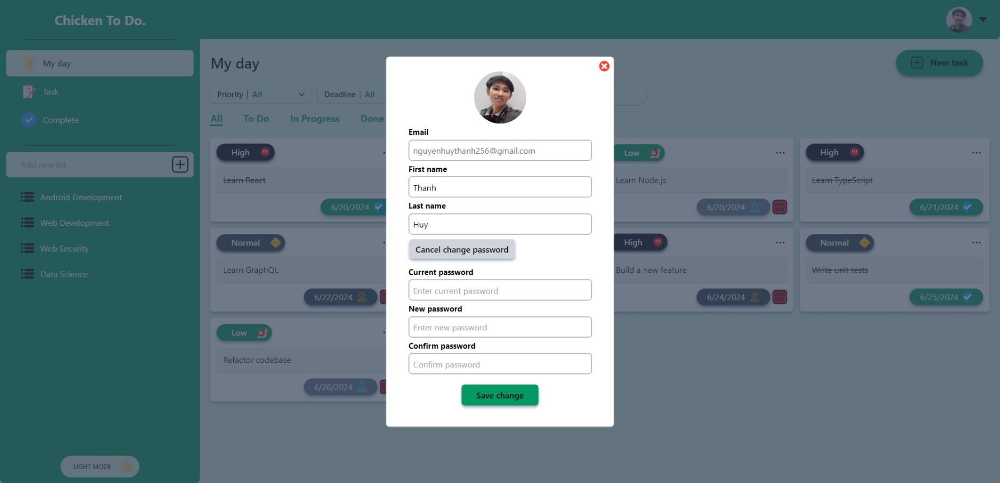
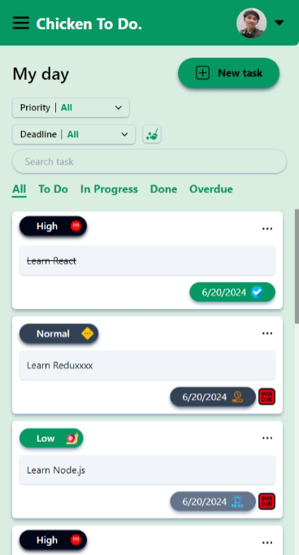

# To-Do List Web Application (Frontend)

The interface for To-Do List Web Application, based on React platform for managing daily tasks. Add, edit, and delete tasks with a user-friendly interface.

## Key Technologies

- **React (v18.3.1)**
- **Redux (v4.1.2)**
- **React Router DOM (v6.3.0)**
- **Tailwind CSS (v3.4.3)**
- **Date-fns (v3.6.0)**

## Getting Started

To get a local copy up and running follow these simple steps.

### Prerequisites

- Node.js installed on your machine
- npm (Node Package Manager)

### Installation

1. Clone the repository:
```bash
git clone https://github.com/chickenHuy/to-do-web.git
```

2. Navigate to the project directory:
```bash
cd client
```

3. Install the required dependencies:
```bash
npm install
```

4. Start the development server:
```bash
npm start
```

5. Open your browser and visit `http://localhost:3000/` to view the application.

### Web page preview
*Login Page*


*Register Page*


*Home Page (Light mode)*


*Home Page (Dark mode)*


*Task Overview*


*Other Pages*


<p align="center">
  
</p>

## Contact

Thanh Huy - [Facebook : Thanh Huy](https://www.facebook.com/profile.php?id=100024283741045) - nguyenhuythanh256@gmail.com

Project Link: [https://github.com/chickenHuy/to-do-web](https://github.com/chickenHuy/to-do-web)

## Acknowledgments

- [React](https://reactjs.org/)
- [Redux](https://redux.js.org/)
- [Tailwind CSS](https://tailwindcss.com/)
- [React Router](https://reactrouter.com/)

